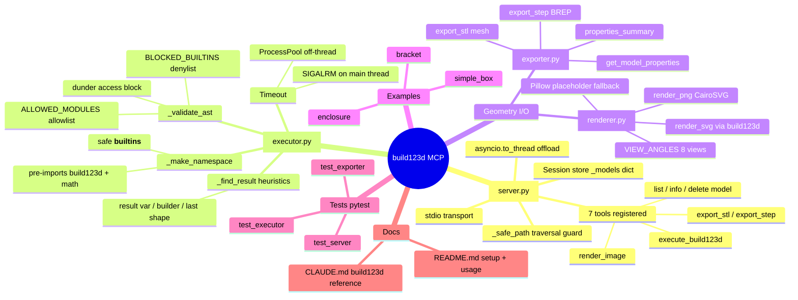

# 🧭 Introspection: build123d-claude-plugin
> Generated by [introspector](https://github.com/fingerskier/introspector) on 2026-06-03T21:44:58.135Z · mode: **code** · enriched by guided tour

**21** files · **1,942** lines · **8** code · **4** test · **2** docs · **5** modules

A Python **MCP server** that lets Claude author parametric CAD models with
[build123d](https://github.com/gumyr/build123d) (an OpenCascade-backed library).
The model talks to it over stdio: submit build123d code → get a shape stored by
name → export it to STL/STEP or render it to an image. Untrusted code runs through
an **AST-validated sandbox** before `exec`.

## Mindmap



## Guided tour

Suggested reading order to understand this codebase:

1. **Read the contract first** — `README.md` then `CLAUDE.md`. README covers
   install/setup; CLAUDE.md is a dense build123d cheat-sheet (API modes, shapes,
   operations) that doubles as the prompt context for code generation.

2. **`src/build123d_mcp/server.py` — the front door (407 LOC).** Defines the
   `Server("build123d")`, declares 7 MCP tools in `list_tools()`, and dispatches
   them in `call_tool()` to `_handle_*` coroutines. Key concepts:
   - **Session state:** `_models: dict[str, Any]` is an in-memory store keyed by
     `model_name`. Created shapes live here until `delete_model`.
   - **Safety:** `_safe_path()` resolves every user file path under `_output_dir`
     and rejects traversal escapes. Validation bounds (code length, tolerance,
     image dims, view enum) are checked before doing work.
   - **Concurrency:** blocking CAD calls are pushed off the event loop via
     `asyncio.to_thread(...)` — which is *why* the executor needs a non-signal
     timeout path (see below).

3. **`src/build123d_mcp/executor.py` — the sandbox (375 LOC).** The security
   core. Flow of `execute_code()`:
   - `_validate_ast()` walks the AST and rejects disallowed imports
     (`ALLOWED_MODULES` allowlist), blocked builtins (`BLOCKED_BUILTINS`), and
     dunder attribute access *before* anything runs.
   - `_make_namespace()` builds the exec globals: all public `build123d` names
     pre-imported, `math` flattened in, and a scrubbed `__builtins__`
     (`BLOCKED_BUILTINS` removed, no leading-underscore names).
   - **Timeout is dual-path:** `SIGALRM` when on the main thread; otherwise
     `_execute_in_process()` runs in a `ProcessPoolExecutor` with a hard timeout.
     This matters because `server.py` calls it from `asyncio.to_thread` (not the
     main thread).
   - `_find_result()` is the "what did the user build?" heuristic: explicit
     `result` var → last `BuildPart/Sketch/Line` builder → last assigned shape
     (via AST) → any shape in namespace.

4. **Geometry I/O — `exporter.py` (142) & `renderer.py` (176).** Thin adapters
   over build123d. Exporter wraps `export_stl`/`export_step` and extracts
   properties (bbox, volume, area, topology counts). Renderer maps 8 named
   `VIEW_ANGLES` to viewport vectors, produces SVG via build123d, then rasterizes
   to PNG with **CairoSVG** — degrading to a Pillow text placeholder if CairoSVG
   isn't installed.

5. **`examples/` then `tests/`.** Examples (`simple_box`, `bracket`, `enclosure`)
   show real build123d usage in this server's idiom. Tests map 1:1 to source
   modules (`test_executor`, `test_exporter`, `test_server`) — read them to learn
   intended behaviour and the sandbox's accept/reject contract.

### How the pieces connect

```
Claude ──stdio──▶ server.py ──to_thread──▶ executor.execute_code
                     │                          │ _validate_ast → _make_namespace
                     │                          │ exec → _find_result → shape
                     │◀─────────────────────────┘
                     ├──▶ _models[name] = shape   (session store)
                     ├──▶ exporter.export_stl / export_step / properties
                     └──▶ renderer.render_png_base64 / save_svg / save_png
```


## Modules

| Module | Files | LOC | Code | Tests | Top languages |
| --- | ---: | ---: | ---: | ---: | --- |
| `src/build123d_mcp` | 5 | 1104 | 5 | 0 | Python |
| `.` | 8 | 395 | 0 | 0 | Markdown, TOML |
| `tests` | 4 | 315 | 0 | 4 | Python |
| `examples` | 3 | 113 | 3 | 0 | Python |
| `.claude` | 1 | 15 | 0 | 0 | JSON |

**Role of each code module:**
- `server.py` — MCP entry point: tool schemas, dispatch, session store, path safety, CLI `main()`.
- `executor.py` — AST-validated sandbox, namespace builder, dual-path timeout, result detection.
- `exporter.py` — STL/STEP export + geometric property extraction.
- `renderer.py` — named-view SVG/PNG rendering with graceful CairoSVG→Pillow fallback.
- `__init__.py` — package marker / public surface.


## What is tested

Test coverage by file count: **33%** of source-or-test files are tests.

| Test file | Likely target(s) | Contract exercised |
| --- | --- | --- |
| `tests/test_executor.py` | `executor.py` | sandbox accept/reject, result detection, timeout |
| `tests/test_exporter.py` | `exporter.py` | STL/STEP export, property extraction |
| `tests/test_server.py` | `server.py` | tool dispatch, path safety, validation bounds |
| `tests/__init__.py` | `src/build123d_mcp/__init__.py` | package import |


## Documentation outline

- **CLAUDE.md** — build123d cheat-sheet (also the codegen prompt context): MCP
  tools, two API modes, 3D/2D shapes, operations, booleans, transforms, selectors,
  patterns, best practices, code template, export guidelines.
- **README.md** — features, installation/dependencies, Claude Code setup, usage,
  project structure, running tests, security notes, license.


## Languages

| Language | Files |
| --- | --- |
| Python | 12 |
| Markdown | 2 |
| JSON | 1 |
| TOML | 1 |


---
_Enriched by the `introspect` skill. Re-run after substantial code changes to refresh._
